## Beginner HPC Path

A structured introduction to practical HPC usage, from first login to reliable day-to-day workflows.

### Progression map

```mermaid
graph LR
  subgraph Foundation
    n_naiss_intro["NAISS Introduction training days"]
    n_intro["Intro to HPC"]
  end
  subgraph Programming
    n_python_hpc_intro["Intro to Python for HPC"]
    n_python_hpc["Introduction to Python and Using Python in an HPC environment"]
    n_environment_management["Software Environment Management on HPC"]
  end
  subgraph Operations
    n_file_transfer_201["File Transfer 201"]
    n_filesystems_storage["HPC Filesystems and Storage Management"]
    n_job_arrays["Scaling Experiments with SLURM Job Arrays"]
    n_git_version_control["Version Control and Reproducible Research with Git"]
  end
  subgraph Next Step
    n_singularity_workshop["Basic Singularity/Apptainer workshop"]
  end
  n_naiss_intro --> n_intro
  n_intro --> n_python_hpc_intro
  n_python_hpc_intro --> n_python_hpc
  n_python_hpc --> n_environment_management
  n_environment_management --> n_file_transfer_201
  n_file_transfer_201 --> n_filesystems_storage
  n_filesystems_storage --> n_job_arrays
  n_job_arrays --> n_git_version_control
  n_git_version_control --> n_singularity_workshop
```

### Recommended order

1. [NAISS Introduction training days](/all-training/naiss-intro.md)
2. [Intro to HPC](/all-training/intro.md)
3. [Intro to Python for HPC](/all-training/python-hpc-intro.md)
4. [Introduction to Python and Using Python in an HPC environment](/all-training/python-hpc.md)
5. [Software Environment Management on HPC](/all-training/environment-management.md)
6. [File Transfer 201](/all-training/file-transfer-201.md)
7. [HPC Filesystems and Storage Management](/all-training/filesystems-storage.md)
8. [Scaling Experiments with SLURM Job Arrays](/all-training/job-arrays.md)
9. [Version Control and Reproducible Research with Git](/all-training/git-version-control.md)
10. [Basic Singularity/Apptainer workshop](/all-training/singularity-workshop.md)

### Phase breakdown

#### Foundation
- [NAISS Introduction training days](/all-training/naiss-intro.md)
- [Intro to HPC](/all-training/intro.md)

#### Programming
- [Intro to Python for HPC](/all-training/python-hpc-intro.md)
- [Introduction to Python and Using Python in an HPC environment](/all-training/python-hpc.md)
- [Software Environment Management on HPC](/all-training/environment-management.md)

#### Operations
- [File Transfer 201](/all-training/file-transfer-201.md)
- [HPC Filesystems and Storage Management](/all-training/filesystems-storage.md)
- [Scaling Experiments with SLURM Job Arrays](/all-training/job-arrays.md)
- [Version Control and Reproducible Research with Git](/all-training/git-version-control.md)

#### Next Step
- [Basic Singularity/Apptainer workshop](/all-training/singularity-workshop.md)

### Related paths

- [Developer](./developer.md)
- [Data Science](./data-science.md)
