## Bioinformatics HPC Path

A practical pathway for bioinformatics teams working with sensitive and large datasets, reproducible pipelines, and HPC resources.

### Progression map

```mermaid
graph LR
  subgraph Foundation
    n_naiss_intro["NAISS Introduction training days"]
    n_python_hpc["Introduction to Python and Using Python in an HPC environment"]
  end
  subgraph Data Management
    n_r_hpc["R Programming for HPC and Data Analysis"]
    n_data_management_large["Large Dataset Management for HPC"]
    n_filesystems_storage["HPC Filesystems and Storage Management"]
  end
  subgraph Pipelines
    n_workflow_management["Scientific Workflow Management on HPC"]
    n_singularity_workshop["Basic Singularity/Apptainer workshop"]
    n_job_arrays["Scaling Experiments with SLURM Job Arrays"]
  end
  subgraph Sensitive Data
    n_bianca_sensitive_data["Bianca In-Depth: Improve Your Handling of Sensitive Research Data"]
  end
  n_naiss_intro --> n_python_hpc
  n_python_hpc --> n_r_hpc
  n_r_hpc --> n_data_management_large
  n_data_management_large --> n_filesystems_storage
  n_filesystems_storage --> n_workflow_management
  n_workflow_management --> n_singularity_workshop
  n_singularity_workshop --> n_job_arrays
  n_job_arrays --> n_bianca_sensitive_data
```

### Recommended order

1. [NAISS Introduction training days](/all-training/naiss-intro.md)
2. [Introduction to Python and Using Python in an HPC environment](/all-training/python-hpc.md)
3. [R Programming for HPC and Data Analysis](/all-training/r-hpc.md)
4. [Large Dataset Management for HPC](/all-training/data-management-large.md)
5. [HPC Filesystems and Storage Management](/all-training/filesystems-storage.md)
6. [Scientific Workflow Management on HPC](/all-training/workflow-management.md)
7. [Basic Singularity/Apptainer workshop](/all-training/singularity-workshop.md)
8. [Scaling Experiments with SLURM Job Arrays](/all-training/job-arrays.md)
9. [Bianca In-Depth: Improve Your Handling of Sensitive Research Data](/all-training/bianca-sensitive-data.md)

### Phase breakdown

#### Foundation
- [NAISS Introduction training days](/all-training/naiss-intro.md)
- [Introduction to Python and Using Python in an HPC environment](/all-training/python-hpc.md)

#### Data Management
- [R Programming for HPC and Data Analysis](/all-training/r-hpc.md)
- [Large Dataset Management for HPC](/all-training/data-management-large.md)
- [HPC Filesystems and Storage Management](/all-training/filesystems-storage.md)

#### Pipelines
- [Scientific Workflow Management on HPC](/all-training/workflow-management.md)
- [Basic Singularity/Apptainer workshop](/all-training/singularity-workshop.md)
- [Scaling Experiments with SLURM Job Arrays](/all-training/job-arrays.md)

#### Sensitive Data
- [Bianca In-Depth: Improve Your Handling of Sensitive Research Data](/all-training/bianca-sensitive-data.md)

### Related paths

- [Data Science](./data-science.md)
- [Developer](./developer.md)
