## Data Science on HPC Path

A path for researchers and analysts who need scalable data analysis, AI, and reproducible pipelines on HPC platforms.

### Progression map

```mermaid
graph LR
  subgraph Foundation
    n_python_hpc_intro["Intro to Python for HPC"]
    n_python_hpc["Introduction to Python and Using Python in an HPC environment"]
    n_environment_management["Software Environment Management on HPC"]
  end
  subgraph Analysis Visualisation
    n_r_hpc["R Programming for HPC and Data Analysis"]
    n_paraview["Scientific Visualization with ParaView"]
    n_data_management_large["Large Dataset Management for HPC"]
  end
  subgraph Ai Gpu
    n_ai_hpc["AI and HPC"]
    n_gpu_python["GPU Computing with Python: CuPy and JAX"]
  end
  subgraph Workflows
    n_workflow_management["Scientific Workflow Management on HPC"]
    n_python_debugging["Debugging and Profiling Python on HPC"]
    n_parallel_python_mpi["Parallel Python with MPI"]
  end
  subgraph Advanced
    n_julia_hpc["High-Performance Computing with Julia"]
  end
  n_python_hpc_intro --> n_python_hpc
  n_python_hpc --> n_environment_management
  n_environment_management --> n_r_hpc
  n_r_hpc --> n_paraview
  n_paraview --> n_data_management_large
  n_data_management_large --> n_ai_hpc
  n_ai_hpc --> n_gpu_python
  n_gpu_python --> n_workflow_management
  n_workflow_management --> n_python_debugging
  n_python_debugging --> n_parallel_python_mpi
  n_parallel_python_mpi --> n_julia_hpc
```

### Recommended order

1. [Intro to Python for HPC](/all-training/python-hpc-intro.md)
2. [Introduction to Python and Using Python in an HPC environment](/all-training/python-hpc.md)
3. [Software Environment Management on HPC](/all-training/environment-management.md)
4. [R Programming for HPC and Data Analysis](/all-training/r-hpc.md)
5. [Scientific Visualization with ParaView](/all-training/paraview.md)
6. [Large Dataset Management for HPC](/all-training/data-management-large.md)
7. [AI and HPC](/all-training/ai-hpc.md)
8. [GPU Computing with Python: CuPy and JAX](/all-training/gpu-python.md)
9. [Scientific Workflow Management on HPC](/all-training/workflow-management.md)
10. [Debugging and Profiling Python on HPC](/all-training/python-debugging.md)
11. [Parallel Python with MPI](/all-training/parallel-python-mpi.md)
12. [High-Performance Computing with Julia](/all-training/julia-hpc.md)

### Phase breakdown

#### Foundation
- [Intro to Python for HPC](/all-training/python-hpc-intro.md)
- [Introduction to Python and Using Python in an HPC environment](/all-training/python-hpc.md)
- [Software Environment Management on HPC](/all-training/environment-management.md)

#### Analysis Visualisation
- [R Programming for HPC and Data Analysis](/all-training/r-hpc.md)
- [Scientific Visualization with ParaView](/all-training/paraview.md)
- [Large Dataset Management for HPC](/all-training/data-management-large.md)

#### Ai Gpu
- [AI and HPC](/all-training/ai-hpc.md)
- [GPU Computing with Python: CuPy and JAX](/all-training/gpu-python.md)

#### Workflows
- [Scientific Workflow Management on HPC](/all-training/workflow-management.md)
- [Debugging and Profiling Python on HPC](/all-training/python-debugging.md)
- [Parallel Python with MPI](/all-training/parallel-python-mpi.md)

#### Advanced
- [High-Performance Computing with Julia](/all-training/julia-hpc.md)

### Related paths

- [Beginner](./beginner.md)
- [Bioinformatics](./bioinformatics.md)
