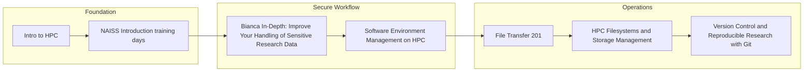

## Sensitive Data Path

A practical route for working safely with sensitive data and secure HPC workflows.

### Progression map

### Recommended order

1. [Intro to HPC](/all-training/intro.md)
2. [NAISS Introduction training days](/all-training/naiss-intro.md)
3. [Bianca In-Depth: Improve Your Handling of Sensitive Research Data](/all-training/bianca-sensitive-data.md)
4. [Software Environment Management on HPC](/all-training/environment-management.md)
5. [File Transfer 201](/all-training/file-transfer-201.md)
6. [HPC Filesystems and Storage Management](/all-training/filesystems-storage.md)
7. [Version Control and Reproducible Research with Git](/all-training/git-version-control.md)

### Phase breakdown

#### Foundation
- [Intro to HPC](/all-training/intro.md)
- [NAISS Introduction training days](/all-training/naiss-intro.md)

#### Secure Workflow
- [Bianca In-Depth: Improve Your Handling of Sensitive Research Data](/all-training/bianca-sensitive-data.md)
- [Software Environment Management on HPC](/all-training/environment-management.md)

#### Operations
- [File Transfer 201](/all-training/file-transfer-201.md)
- [HPC Filesystems and Storage Management](/all-training/filesystems-storage.md)
- [Version Control and Reproducible Research with Git](/all-training/git-version-control.md)

### Related paths

- [Beginner](./beginner.md)
- [Developer](./developer.md)
